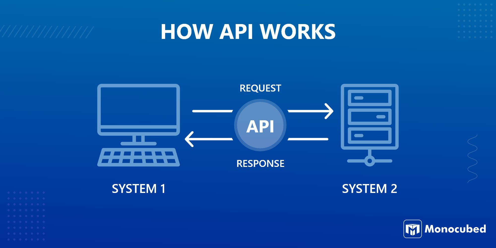

# APIS

API stands for Application Programming Interface. APIs are a helpful way for different software applications to talk to 
each other and exchange information. Similar to how a user interacts with an interfaces with buttons and menus to 
interact with software, applications use APIs to interact with each other.

## Example

Imagine you have two systems: System 1 and System 2. System 1 needs some data or functionality from System 2. Instead of
directly accessing System 2's code, which could be complex and messy, System 1 can use System 2's API. 

This API acts like a middleman, providing a clear set of rules and commands that System 1 can use to communicate with 
System 2.

## Why use APIs
APIs have become incredibly popular for interfacing with tech systems for several reasons:
1) **Standardisation**: APIs provide a way for different software components to communicate with each other with clear rules and protocols, APIs make integration between systems easier and more predictable.

2) **Flexibility**: APIs allow developers to build modular systems. Instead of tightly coupling different components together, APIs enable us to loosely couple them, making it easier to update, replace, or scale components without affecting the entire system.

3) **Reuse**: APIs make code reusable. Developers can leverage existing APIs provided by third-party services or internal systems, saving time and effort, as well as ensuring consistency and reliability across different parts of the application.

4) **Ecosystems**: APIs foster vibrant ecosystems of developers and third-party services. Companies often expose APIs to allow others to extend the functionality of their products or integrate them with other services. This leads to innovation, as developers can combine different APIs to create new and powerful applications that were not possible before.

5) **Scalability**: APIs allow us to make more scalable systems. Systems can handle increased loads more efficiently thanks to APIs supporting features like caching and rate limiting to manage traffic spikes.

6) **Cross-platform compatibility**: APIs enable interoperability between different platforms and technologies. Be it web, mobile, desktop, or IoT devices, APIs provide a common interface that allows applications to interact with each other seamlessly.

## REST

Representational State Transfer (REST) is a software architecture that imposes conditions on how an API should work. 
REST was initially created as a guideline to manage communication on a complex network like the internet. We can use 
REST-based architecture to support high-performing and reliable communication at scale. You can easily implement and modify it, bringing visibility and cross-platform portability to any API system.

API developers can design APIs using several different architectures. APIs that follow the REST architectural style are 
called REST APIs. Web services that implement REST architecture are called RESTful web services. The term RESTful API 
generally refers to RESTful web APIs. However, you can use the terms REST API and RESTful API interchangeably.

### Rest APIs
To fully benefit from the functionality that REST provides, APIs must follow five requirements. Each requirement lays 
ensures a fast and versatile API.

1) **Client-server separation**. All interactions are initiated by the client, not the server. This simplifies communication and ensures independance.
2) **Uniform Interface**. All requests and responses follow a common protocol.
3) **Stateless**. Every interact is independent, and all requests and responses have all the required information.
4) **Layered system**. Additional layers, such as security and traffic management shouldn't change the client-server interaction.
5) **Cacheable**. Information can be stored on the clients device. A server response can specify what should be cached, and for how long.

## HTTP
The **Hypertext Transfer Protocol (HTTP)** is the foundation of the World Wide Web. HTTP is an application layer protocol 
designed to transfer information between networked devices and runs on top of other layers of the network protocol stack.

A typical flow over HTTP involves a client machine making a request to a server, which then sends a response message.

**Hypertext transfer protocol secure (HTTPS)** is the secure version of HTTP. HTTPS is encrypted in order to increase 
security of data transfer. Applications include financial transactions, email services and sharing sensitive information.

### HTTP Requests
In general, an HTTP request is divided into 3 parts:
1) A request line - this includes the HTTP method being used, URL and protocol.
2) A set of header fields - metadata to provide information about the request.
3) A body, which is optional

### HTTP Responses
A response contains: 
1) A response code (to indicate the success or failure of a request)
2) A set of headers
3) A body.

The type of request method used will impact the response. GET requests respond with the requested resource(s) 
whereas a POST request may get a response with success indicator only, or it may respond with the fully populated 
resource which was inserted/posted.

Reponses may be textual or binary format.

### HTTP Verbs
The methods used for HTTP requests are all verbs, and the 5 most common are as follows:
- POST
- GET
- PUT
- PATCH
- DELETE

## Statelessness
Having a client-server interaction be stateless offers us several advantages:

- Simplicity: With statelessness, each request from the client to the server contains all the necessary information for the server to understand and process it.
- Scalability: Statelessness facilitates scalability by allowing servers to handle requests from any client in a consistent manner. 
- Reliability: Stateless communication makes the system more resilient to failures. If a server instance crashes or becomes unavailable, another server can seamlessly take over and handle incoming requests without any disruption to the client.
- Flexibility: Stateless communication allows clients and servers to evolve independently without tightly coupling their implementations. 
- Caching: Statelessness enables efficient caching of responses at various levels of the network stack, including client-side caches, proxy servers, and content delivery networks (CDNs). 

Statelessness of client-server interactions promotes simplicity, scalability, reliability, and flexibility, making it an
important principle in the design of systems and web services.